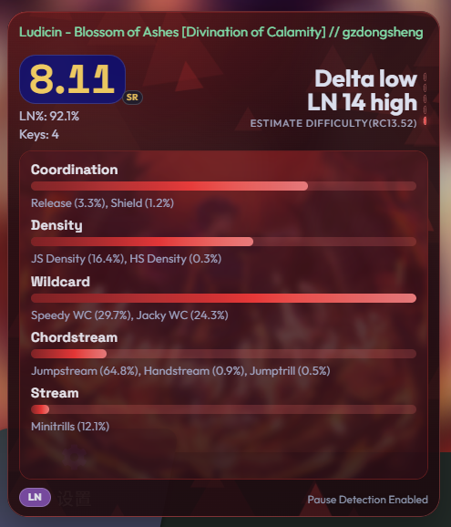
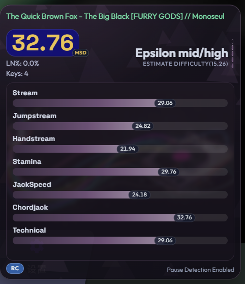
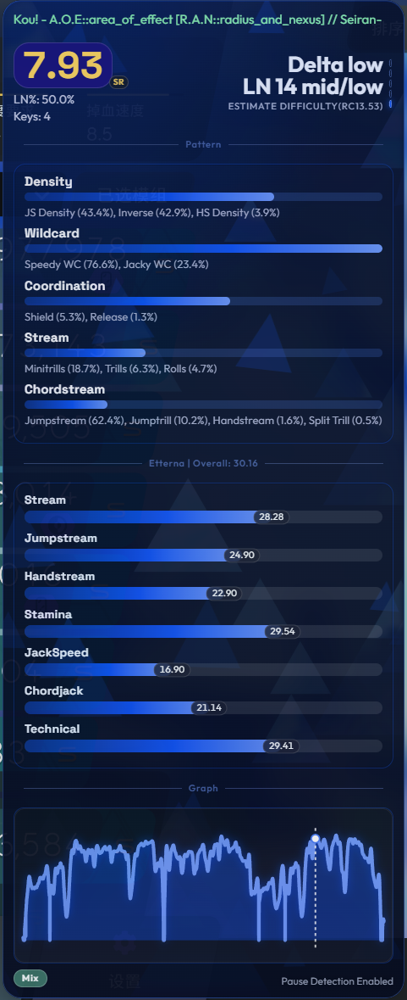

# osumania_map_analyser
**English | [中文](README.md)**

> **Translation Note**: This document was translated from Chinese to English with the assistance of an AI language model. While efforts have been made to ensure accuracy, please refer to the original Chinese version if any ambiguity arises.
****
This repository is an entirely AI-crafted in-game overlay (ppcounter) for [tosu](https://tosu.app), providing real-time support for osu!mania (4/6/7K/Lazer/Stable) across multiple mods. It offers estimated difficulty, RC/LN pattern analysis, customizable Etterna version for MSD calculation, difficulty graphs, and pause detection.

Update: New Theme Screenshots

## Key Features
- **Real-time Analysis**: Analyzes various data of the current beatmap in real-time during gameplay or beatmap selection.
- **Multi-mod Support**: Compatible with multiple mods in both lazer and stable, supporting custom speed multipliers and OD adjustments.
- **Customizable Etterna Version**: Allows users to select different versions of [Etterna](https://github.com/etternagame/etterna) MinaCalc for calculations.
- **Pause Detection**: Detects pauses during gameplay and marks their positions on the graph.
- **Difficulty Estimation**: Estimates difficulty based on beatmap data and provides detailed analysis results, offering multiple estimation algorithms. Compatible with LN and RC Dans for 4/6/7K.
- **Graph Visualization**: Provides difficulty variation graphs to help players better understand the difficulty distribution of a beatmap.
- **Pattern Analysis**: Analyzes RC/LN pattern distribution in the beatmap to help players understand its structure.
- **SV Detection**: Detects whether a beatmap is an SV (speed variation) map.
- **Highly Customizable**: Offers a wealth of customization options to meet the needs of different players.

## Usage
1. Go to the [Release](https://github.com/LeoBlackMT/osumania_map_analyser/releases/latest) page and download the latest version.
2. Extract the downloaded file to any location.
3. Place the entire folder in the `static` directory of tosu.
4. Launch tosu, go to the dashboard, and you will find the "ManiaMapAnalyser" plugin. Click the `Settings` button on the right to configure it.
5. For instructions on using the in-game interface and OBS, please refer to the relevant tosu documentation.

## Estimator Algorithm Benchmark
- The difficulty estimation algorithms of this plugin have been benchmarked against real beatmap data, and the results can be viewed [here](https://leoblackmt.github.io/osumania_map_analyser/). The tests cover the performance of multiple algorithms across different types of beatmaps, helping players choose the one that suits them best.
- It is important to note that while the benchmark provides a reference for algorithm performance, actual usage may be influenced by various factors such as beatmap characteristics and mod combinations. Players are encouraged to combine the benchmark results with their own gameplay experience for judgment.
- You can download the beatmap data used for benchmarking [here](https://github.com/LeoBlackMT/osumania_map_analyser/tree/main/docs/data/files.7z). However, please read the disclaimer and use the data responsibly.

## Notes
1. The plugin needs to run in the `static` directory of tosu. Ensure it is placed directly in that directory, not nested inside another folder.
2. This plugin relies on the correct parsing of beatmap data. Certain special or non-standard beatmaps may lead to inaccurate analysis results.
3. If game lag causes false positives, consider increasing the pause detection threshold.
4. Although the difficulty estimation algorithms have been tuned, inaccuracies may still exist; please use them only as a reference. For 4K, high difficulties are generally more accurate with an overall error of no more than half a Dan, while low difficulties may be less accurate; in specific patterns like Minijack, Stamina, and Anchor, the estimation results may have larger deviations. For 6K and 7K, the overall performance is relatively average. It is recommended that players combine the estimation results with their actual gameplay experience for judgment and not rely too heavily on the estimates.
5. The plugin's performance may be affected by the complexity of the beatmap and the features selected; in some cases, lag or delays may occur. Please adjust the settings according to your actual situation for a better experience.
6. If you encounter any issues, feel free to submit an issue.

## Settings
Note: It is recommended to start with the default settings and then adjust according to personal preference.
- **Module Settings**:
    - **Card Body Content**: Select what to display in the main body of the card.
        - None: Displays nothing. Short card mode.
        - Auto: Automatically selects Pattern or Etterna based on the LN ratio of the beatmap.
        - Pattern: Displays pattern analysis.
        - Etterna: Displays Etterna's 7 major skill set breakdowns.
        - Graph: Displays the difficulty variation graph.
        - Full: Displays full content including pattern analysis, difficulty graph, and Etterna scores. Not recommended for daily use — may feel crowded.
        - Note: For non-4/6/7K beatmaps, body content automatically falls back to Pattern.
    - **Top-left Capsule Text**: Select what to display in the top-left capsule.
        - Auto: Automatically selects ReworkSR or MSD based on the LN ratio of the beatmap.
        - ReworkSR: Displays [Suuny Rework](https://github.com/sunnyxxy/Star-Rating-Rebirth) star rating.
        - MSD: Displays Etterna MSD. *Only compatible with 4/6/7K beatmaps.
        - InterludeSR: Displays [Interlude](https://github.com/YAVSRG/YAVSRG) star rating.
        - Pattern: Displays the overall pattern.
    - **Top-right Content**: Select what to display in the top-right of the card.
        - None: Displays nothing.
        - Graph: Displays the difficulty variation graph.
        - Difficulty: Displays the estimated difficulty.
        - MSD: Displays Etterna MSD. *Only compatible with 4/6/7K beatmaps.
        - InterludeSR: Displays Interlude star rating.
        - ReworkSR: Displays Suuny Rework star rating.
        - Pattern: Displays the overall pattern.
    - **Map Tag Capsule**: Whether to display the beatmap tag capsule.
        - Includes HB/RC/LN/Mix/SV tags.
        - Automatically determined based on beatmap characteristics.
- **Theme & Effects**:
    - **osu!Lazer Card Theme**: Whether to enable the Lazer-style card theme.
        - When enabled, the card adopts a design style similar to osu!lazer, and enables certain settings only available under the Lazer theme.
    - **Floating Triangles Animation**: Whether to enable the floating triangle animation effect on the card background.
        - This option only takes effect when the Lazer Card Theme is enabled.
    - **Cover Art Background**: Whether to use the beatmap's background image as the card background.
        - This option only takes effect when the Lazer Card Theme is enabled.
        - When enabled, the card's color theme will be extracted from the beatmap background, enhancing visual effects; when disabled, a solid color background is used — pairing with the Custom Background Color setting is recommended.
    - **Custom Background Color**: Set a custom background color for the card.
        - This option only takes effect when the Lazer Card Theme is enabled.
        - Even when using the beatmap background as the card background, you can set a custom color via this option.
        - Set to pure black (#000000) to disable this feature and sample colors from the beatmap background or use a deep black background.
    - **Rainbow Bars**: Whether to enable rainbow bars under the Etterna display.
        - It is recommended to disable this option when the Lazer Card Theme is enabled for a more unified visual style.
    - **Metadata Marquee**: Whether to enable horizontal scrolling for beatmap metadata.
    - **Numeric Difficulty**: Whether to display numerical difficulty values.
        - When enabled, numerical difficulty will be shown after the "ESTIMATE DIFFICULTY" label under the RC estimation algorithm.
    - **Hide During Play**: Whether to hide the card during gameplay.
    - **Reverse Card Extension**: Whether to reverse the card expansion direction.
        - When enabled, the card stays anchored at the bottom and grows upward; when disabled, it expands downward by default.
    - **Card Opacity**: Set the overall card opacity.
        - Available values: 100% / 95% / 90% / 80% / 70%.
    - **Content Background Blur**: Whether to enable background image blur for content sections.
        - When enabled, the background behind the card's content areas will have a blur effect, enhancing readability and visual depth.
    - **Card Radius**: Set the card corner roundness.
        - Small / Medium / Large.
- **Functional Settings**:
    - **Pause Detection**: Whether to enable pause detection.
        - Recommended: When enabled, pause positions will be displayed on the difficulty graph, and the pause count will be shown in the bottom-right corner of the card.
    - **Enable Update Check**: Whether to enable version update checking.
        - When enabled, it checks the GitHub latest release at most once per day by default.
        - When switching from disabled to enabled, it immediately triggers one extra check.
        - The star icon on the left side of the status bar is shown only when a newer version is available.
    - **Vibro Detection**: Whether to enable vibro detection.
        - Recommended: When enabled, the plugin will detect if a beatmap is a vibro map and display it as "Vibro" in the estimated difficulty; otherwise, you will see an extremely inflated difficulty estimate.
    - **SV Detection**: Whether to enable SV beatmap detection.
        - When enabled, an SV tag will be displayed in the bottom-left corner when speed variation is detected.
        - Note: If the Map Tag Capsule display is not enabled, the SV tag will not be shown.
    - **Pause Detection Threshold**: Set the minimum duration (ms) for a time freeze to be counted as a pause.
        - A pause is only confirmed when the game time has been frozen for longer than this threshold.
        - Default is 500ms. If game lag causes false positives, increase this value appropriately.
    - **Estimator Algorithm**: Choose the algorithm used for difficulty estimation.
        - Mixed: (Recommended) A hybrid algorithm combining the four below, offering relatively higher accuracy. Automatically selects the algorithm best suited for the current beatmap.
        - Azusa: A fusion algorithm oriented towards 4K RC, combining the algorithms below with targeted adjustments. Performs well in RC scenarios but is not suitable for LN-dominant beatmaps.
        - Suuny: Maps directly to Dan star ratings using Suuny Rework. Compatible with LN and RC Dans for 4/6/7K.
        - [Daniel](https://thebagelofman.github.io/Daniel/): Uses the Daniel algorithm for estimation, suitable for 4K Reform Alpha and above Dan difficulties.
        - [Companella](https://github.com/Leinadix/companella): Uses the Companella algorithm for estimation, suitable for 4K Reform Delta+ and below Dan difficulties.
    - **Global Etterna Version**: Select the Etterna MinaCalc version used for MSD and related calculations.
        - Different versions of Etterna may yield different MSD results; you can choose your preferred version.
        - The default value 0.72.3 is personally recommended.
        - Changing this setting will affect all features that depend on Etterna calculations, except for the Companella estimation algorithm.
        - 4K uses the selected version directly; 6K/7K prioritize 0.74.0 for stability.
        - If the current version is unavailable or does not support the current key count, it will automatically fall back to an available version.
    - **Companella Etterna Version**: Select the Etterna MinaCalc version used exclusively for the Companella estimation algorithm.
        - This setting only affects the Companella algorithm's calculations; other features will continue to use the version set in Global Etterna Version.
        - The default value is 0.74.0. It is recommended to keep this setting at 0.74.0, as Companella was developed and calibrated based on Etterna 0.74.0's MinaCalc.
        - You can switch to other versions to observe their performance with the Companella algorithm, but please be aware that results may be inaccurate.
- **Network Configuration**:
    - **WebSocket Endpoint**: Configure the address and port of the WebSocket server.
        - Ensure this address and port match those configured in tosu, so it can receive data from tosu.
        - The same host:port is also used to construct the beatmap file request URL: `http://{host:port}/files/beatmap/file`.
        - Adjusting this setting allows you to use the plugin on other devices on the same local network, such as displaying analysis results on a mobile phone or tablet.
        - The default value is `localhost:24050`.
- **Debug Settings**:
    - **Use Amount For Category**: Whether to enable pattern classification logic based on the beatmap's Cluster Amount.
        - When enabled, pattern classification will be based on the number of objects in the beatmap, which **may** more accurately identify certain beatmaps.
    - **Azusa Sunny Reference Force HO**
        - When enabled, the Azusa algorithm will be forced to treat the beatmap as a pure RC (HO) map.
        - It is enabled by default; please do not disable it casually.

## Azusa Algorithm Explanation
This algorithm builds on the beatmap itself, combining the results of Daniel and Suuny Rework, with specific adjustments targeted at 4K RC beatmaps. For more details, please refer to [this document](azusa_algorithm.md) (English).

## References
- [tosu](https://tosu.app): The runtime environment and basic framework for this plugin.
- [Etterna](https://github.com/etternagame/etterna): Etterna's MinaCalc is used for difficulty estimation and MSD calculation.
- [Suuny Rework](https://github.com/sunnyxxy/Star-Rating-Rebirth): Suuny Rework's algorithm is used for difficulty estimation.
- [Interlude](https://github.com/YAVSRG/YAVSRG): Interlude's RC pattern analysis algorithm is used, with LN detection logic added on top.
- [Daniel](https://thebagelofman.github.io/Daniel/): Daniel's algorithm is used for difficulty estimation.
- [Companella](https://github.com/Leinadix/companella): Companella's algorithm is used for difficulty estimation.

## Special Thanks
- [inuiyumegan](https://github.com/inuiyumegan): Provided a large amount of beatmap data for algorithm debugging and benchmarking.
- [greycsont](https://github.com/greycsont): Contributed several features.
- [ZHAO20060708](https://github.com/ZHAO20060708): Provided the polished Lazer theme and Full mode design.
